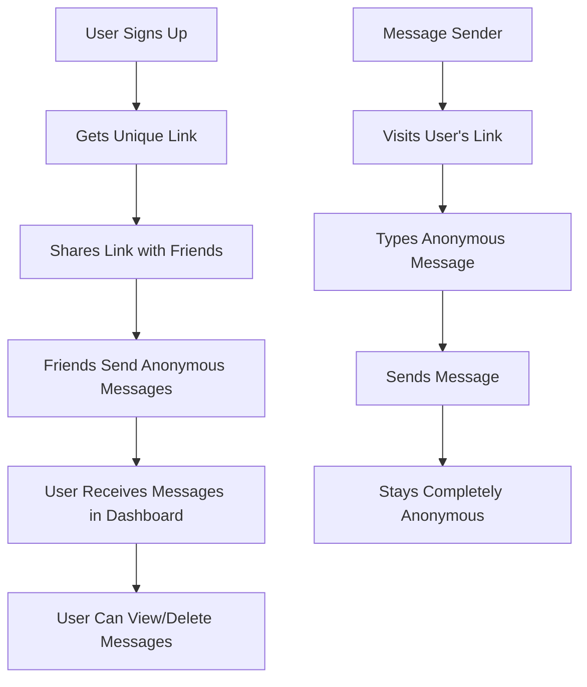

# 🎉 Askly

**Fun anonymous text messages platform** - Share secrets, ask questions, and have entertaining conversations without revealing your identity.

[](https://www.asklyy.tech)
[](https://nextjs.org)
[](https://typescriptlang.org)

## 🚀 Quick Start

```bash
# Clone & Install
git clone https://github.com/HimanshuTamoli/askly.git
cd askly
npm install

# Setup Environment
cp .env.example .env.local
# Add your MongoDB URI, NextAuth secret, and Resend API key

# Run Development Server
npm run dev
```

Open [http://localhost:3000](http://localhost:3000) 🎯

## 📱 How It Works



## ✨ Features

- 🔒 **Anonymous Messaging** - Send messages without revealing identity
- 👤 **Unique Profiles** - Get your own asklyy.tech/u/username link
- 📊 **Message Analytics** - Track your message stats
- 🎨 **Modern UI** - Beautiful, responsive design
- ⚡ **Real-time Updates** - Live message notifications

## 🛠️ Tech Stack

- **Frontend**: Next.js 15, TypeScript, Tailwind CSS
- **Backend**: Next.js API Routes, NextAuth.js
- **Database**: MongoDB with Mongoose
- **Email**: Resend
- **Deployment**: Vercel

## 📁 Project Structure

```
askly/
├── src/app/           # Next.js App Router
├── src/components/    # React Components
├── src/lib/          # Utilities & Config
├── src/models/       # Database Models
└── public/           # Static Assets
```

## 🔧 Environment Variables

```env
MONGODB_URI=your_mongodb_connection_string
NEXTAUTH_URL=http://localhost:3000
NEXTAUTH_SECRET=your_nextauth_secret
RESEND_API_KEY=your_resend_api_key
```

## 🚀 Deploy

[](https://vercel.com/new/clone?repository-url=https://github.com/HimanshuTamoli/askly)

## 📄 License

MIT License - see [LICENSE](LICENSE) file

---

<div align="center">

**Made with ❤️ by [HimanshuTamoli](https://github.com/HimanshuTamoli)**

[🌐 Website](https://www.asklyy.tech) • [📧 Support](mailto:support@asklyy.tech)

</div>